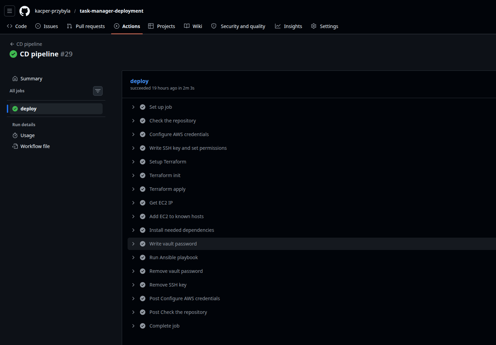
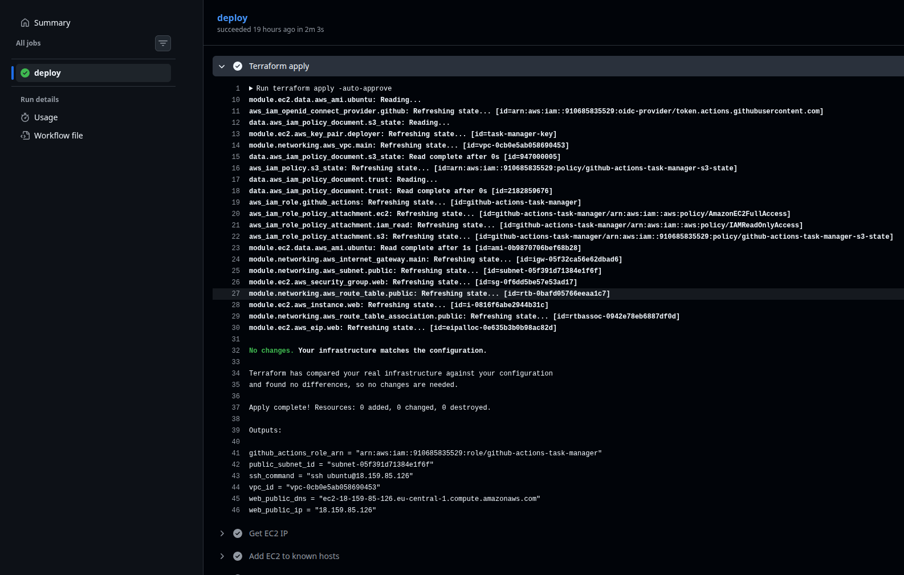
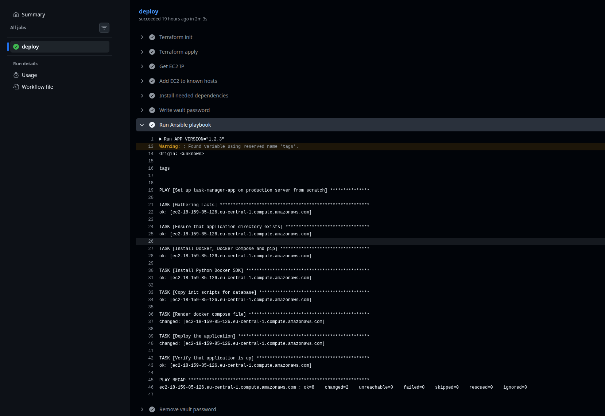
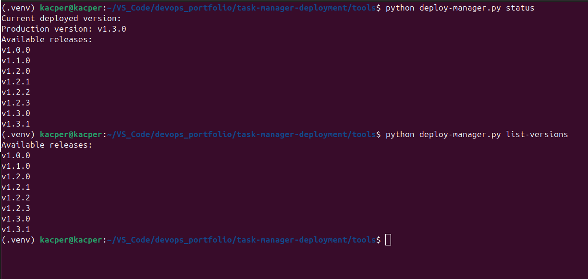

# task-manager-deployment

Infrastructure provisioning, deployment automation, and CD pipeline for [task-manager-app](https://github.com/kacper-przybyla/task-manager-app). This repository provisions AWS infrastructure with Terraform, deploys the application with Ansible, and exposes a Python CLI tool for managing deployments from a local machine.

**Live application:** http://18.159.85.126/

---

## What This Repository Contains

| Directory | Purpose |
|---|---|
| `terraform/` | AWS infrastructure: VPC, EC2, Elastic IP, OIDC IAM role |
| `ansible/` | Application deployment: playbook, templates, secrets vault, dynamic inventory |
| `tools/` | Python CLI: list versions, deploy, rollback, check status |
| `.github/workflows/` | CD pipeline: provisions infrastructure and deploys on every CI trigger |

The CI pipeline in `task-manager-app` sends a `repository_dispatch` event here when new images are built. This repository receives it, provisions infrastructure if needed, and deploys the new version.

---

## Architectural Decisions

### 1. Separate repositories for app and deployment, connected by `repository_dispatch`

The application code lives in `task-manager-app`; infrastructure and deployment config live here. When CI in the app repo builds and pushes a new image, it sends a `repository_dispatch` event (`event_type: deploy`, `client_payload.sha`) to this repo, which triggers `deploy.yml`.

The alternative — a monorepo with a single pipeline — would couple every commit to deployment infrastructure changes. Separate repos means the app team can evolve CI independently, and deployment config changes don't create noise in the application's commit history. `repository_dispatch` specifically was chosen over a scheduled poll (introduces latency and runs regardless of whether anything changed) and over a generic webhook (requires an exposed endpoint or a self-hosted runner to receive it). GitHub's own eventing system handles delivery and retry.

### 2. OIDC instead of long-lived IAM access keys

`terraform/iam.tf` creates an OIDC identity provider for `token.actions.githubusercontent.com` and an IAM role that only GitHub Actions can assume. The trust policy has two conditions: `aud` must equal `sts.amazonaws.com`, and `sub` must match `repo:kacper-przybyla/task-manager-deployment:*`. The workflow requests a short-lived JWT, exchanges it for temporary STS credentials, and those credentials expire when the run ends.

The alternative is an IAM user with `AWS_ACCESS_KEY_ID` / `AWS_SECRET_ACCESS_KEY` stored as repository secrets. Long-lived keys are a permanent credential — if a secret leaks, the blast radius is unbounded until someone rotates it. OIDC credentials are scoped to one workflow run and expire automatically.

### 3. S3 remote state instead of local `terraform.tfstate`

`terraform/providers.tf` configures the S3 backend at `kacper-przybyla-terraform-state/task-manager/terraform.tfstate`. This is what makes the CD pipeline viable: GitHub Actions can run `terraform apply` on every deploy because it reads from the same state that was written by the last run — whether that was CI or a local machine. Without remote state, every CI run would start with no state file, think every resource is new, and try to create duplicate infrastructure.

### 4. Elastic IP instead of relying on the instance's public IP

`terraform/modules/ec2/main.tf` attaches an `aws_eip` to the instance. EC2 assigns a new public IP every time an instance stops and starts. Without the Elastic IP, `terraform apply` after an instance replacement would produce a different IP — breaking the live URL hardcoded in the README, invalidating `~/.ssh/known_hosts` on the CI runner, and requiring a manual update to anything that references the address. The Elastic IP is a stable handle that stays constant even when the underlying instance is replaced.

### 5. Dynamic EC2 inventory instead of a static hosts file

`ansible/inventory/aws_ec2.yml` uses the `amazon.aws.aws_ec2` plugin to query AWS at runtime, filtering for instances with `tag:Project=task-manager` in state `running` in `eu-central-1`. Ansible resolves the actual host address at each run.

A static inventory file with a hardcoded IP would break silently any time Terraform replaces the instance — the playbook would attempt to SSH to an IP that no longer belongs to the right host, or fail to connect entirely. The dynamic plugin always reflects real AWS state.

### 6. `terraform apply` (not just `plan`) in the CD pipeline

`deploy.yml` runs `terraform apply -auto-approve` before every Ansible step. This means infrastructure is reconciled on every deployment — if someone manually terminated the EC2 instance, the next triggered deploy recreates it rather than failing at the Ansible step. Infrastructure and application deployment happen atomically in the same workflow run.

Running only `terraform plan` would require a human to review and apply separately, which defeats the purpose of a CD pipeline. The tradeoff is that `apply` is destructive if the plan contains unexpected changes, but since the configuration is version-controlled and infrastructure changes are reviewed in PRs, this risk is acceptable.

### 7. Ansible playbook as both initial setup and rolling update

`ansible/deploy.yml` is idempotent. `apt` with `state: present` only installs if missing. The `community.docker.docker_compose_v2` module with `pull: always` always pulls the latest image tag and reconciles container state. Running the playbook on a fresh instance does the full setup; running it on an already-configured instance just updates the image.

The alternative — separate "bootstrap" and "update" playbooks — would require the pipeline to detect whether an instance is new and branch accordingly. A single idempotent playbook is simpler to reason about and to test.

### 8. Atomic history writes in `deploy-manager.py`

`save_history()` in `tools/deploy-manager.py` writes the deployment record to a `.tmp` file first, then calls `os.replace()` to rename it into place. On POSIX systems, `rename()` is atomic — the file either contains the old content or the new content, never a partial write. If the process is killed between the JSON serialization and the file being written, the existing history file is unaffected.

Writing directly to `~/deploy_history.json` would leave a truncated, unparseable file if interrupted mid-write. The next invocation would fail to load history and lose rollback eligibility for all previous deployments.

---

## Infrastructure (Terraform)

### Remote State

Terraform state is stored remotely in S3:

```
bucket: kacper-przybyla-terraform-state
key:    task-manager/terraform.tfstate
region: eu-central-1
```

This means any machine with the right IAM permissions can run Terraform — including GitHub Actions — without state conflicts.

### Module Structure

```
terraform/
├── main.tf         Root module — instantiates networking and ec2 modules
├── providers.tf    S3 backend + AWS provider declaration
├── iam.tf          OIDC provider + IAM role for GitHub Actions
├── variables.tf    Input variable declarations
├── outputs.tf      Proxied outputs from modules
├── terraform.tfvars  Concrete variable values (aws_region, environment, etc.)
└── modules/
    ├── networking/   VPC, subnet, internet gateway, route table
    └── ec2/          AMI lookup, key pair, security group, Elastic IP, EC2 instance
```

### What Gets Provisioned

**networking module** creates:
- VPC (`10.0.0.0/16`) with DNS hostnames enabled
- Public subnet (`10.0.1.0/24`) in `eu-central-1a` with auto-assign public IP
- Internet gateway and route table with `0.0.0.0/0 → IGW`

**ec2 module** creates:
- Security group: inbound TCP 22, 80, 443 from `0.0.0.0/0`; all outbound
- SSH key pair from `~/.ssh/id_ed25519.pub`
- EC2 instance: `t3.micro`, Ubuntu 24.04 LTS (latest AMI), user data installs Docker and docker-compose on first boot
- Elastic IP attached to the instance — the public IP is stable across stop/start cycles

**iam.tf** creates:
- OIDC identity provider for `token.actions.githubusercontent.com`
- IAM role `github-actions-task-manager` — trusted only by this repository (`repo:kacper-przybyla/task-manager-deployment:*`)
- Attached policies: `AmazonEC2FullAccess`, `IAMReadOnlyAccess`, and an inline policy for S3 state bucket access

### OIDC Authentication

GitHub Actions authenticates to AWS using OpenID Connect — no static AWS credentials are stored anywhere. On each workflow run, GitHub generates a short-lived JWT token. The `configure-aws-credentials` action exchanges it for temporary AWS credentials by assuming the `github-actions-task-manager` IAM role.

The trust policy enforces that only workflows running from this specific repository can assume the role.

---

## Deployment (Ansible)

### Dynamic Inventory

Instead of a static host list, Ansible queries EC2 directly at runtime using the `amazon.aws.aws_ec2` plugin. It filters for instances tagged `Project=task-manager` in state `running` in `eu-central-1`. This means the inventory is always current — no manual IP updates needed after Terraform provisions a new instance.

### What the Playbook Does

**File:** `ansible/deploy.yml` — runs against the `app_servers` group with `become: true`

Tasks in order:

1. **Create application directory** — ensures `/opt/taskmanager` exists with correct ownership
2. **Install dependencies** — `docker.io`, `docker-compose-v2`, `python3-pip` via apt
3. **Install Python Docker SDK** — required by the `community.docker.docker_compose_v2` module
4. **Copy database init scripts** — SQL migration files copied to `/opt/taskmanager/database/`
5. **Render docker-compose.yml** — Jinja2 template filled with variables from `group_vars` and vault secrets, written to `/opt/taskmanager/docker-compose.yml`
6. **Deploy the application** — `community.docker.docker_compose_v2` with `pull: always` — pulls the latest images and brings services up
7. **Verify deployment** — polls `http://localhost/api/health` up to 5 times with 10-second delays, confirms `status: healthy`

The playbook is idempotent — running it multiple times produces the same result. It functions as both initial setup and rolling update.

### Secrets Management

Database credentials are stored encrypted in `ansible/vault/secrets.yml` using Ansible Vault (AES256). The vault contains:

- `vault_postgres_user`
- `vault_postgres_password`
- `vault_database_url`

These are referenced in `group_vars/app_servers.yml` and injected into the Jinja2 template at deploy time. The vault password is stored as a GitHub Actions secret (`ANSIBLE_VAULT_PASSWORD`) and written to a temporary file during the workflow run, then deleted in a cleanup step that runs even on failure.

### Jinja2 Template

`ansible/templates/docker-compose.yml.j2` generates the production `docker-compose.yml` on the remote host. It uses variables from `group_vars` to set image tags, resource limits (CPU and memory), database credentials, and restart policies. The `app_version` variable controls which image tag is pulled — passed in from the CD pipeline at deploy time.

---

## CD Pipeline

**File:** `.github/workflows/deploy.yml`

### Triggers

| Event | Details |
|---|---|
| `repository_dispatch` | `event_type: deploy` — sent by CI in `task-manager-app` with `client_payload.sha` |
| `workflow_dispatch` | Manual trigger with required `sha` input |

Both paths resolve the version to deploy: `repository_dispatch` uses `client_payload.sha`, `workflow_dispatch` uses the `inputs.sha` value.

### Steps

1. Checkout repository
2. Configure AWS credentials via OIDC (assumes `github-actions-task-manager` role)
3. Write SSH private key to `~/.ssh/id_ed25519` (from `SSH_PRIVATE_KEY` secret), set permissions
4. Setup Terraform, run `terraform init` and `terraform apply -auto-approve`
5. Read EC2 IP from `terraform output -raw web_public_ip`
6. Add EC2 to SSH known hosts (polls `ssh-keyscan` up to 10 times, 10-second intervals)
7. Install Ansible, boto3, botocore; install `amazon.aws` and `community.docker` collections
8. Write vault password to `/tmp/vault_pass` (from `ANSIBLE_VAULT_PASSWORD` secret)
9. Run playbook: `ansible-playbook deploy.yml --vault-password-file /tmp/vault_pass -e "app_version=<sha>"`
10. Remove vault password file (runs even on failure)
11. Remove SSH key files (runs even on failure)

Secrets cleanup steps use `if: always()` to ensure credentials are removed even if the deployment fails midway.

---

### GitHub Secrets Required

| Secret | Purpose |
|---|---|
| `SSH_PRIVATE_KEY` | EC2 SSH access (ed25519 private key) |
| `SSH_PUBLIC_KEY` | EC2 key pair registration |
| `ANSIBLE_VAULT_PASSWORD` | Decrypts `vault/secrets.yml` |
| `DEPLOY_TOKEN` | Used by `task-manager-app` CI to send `repository_dispatch` |

---

### Screenshots

**CD pipeline — all steps green**


**Terraform apply — infrastructure reconciled**


**Ansible playbook — deployment tasks**


**CLI tool — status and list-versions**


---

## Python CLI Tool

**File:** `tools/deploy-manager.py` (~250 lines, hand-written)

A local deployment management tool that interacts with the live system via the GitHub API and SSH. It does not bypass the CD pipeline — it triggers the same `deploy.yml` workflow that the CI uses.

### Setup

```bash
cd tools
pip install -r requirements.txt  # requests, pyyaml, python-dotenv
cp .env.example .env
# Add your GITHUB_TOKEN to .env
```

### Commands

**`list-versions`** — shows all semantic version releases available in GHCR

```bash
python deploy-manager.py list-versions
# v1.0.0
# v1.1.0
# v1.3.1
```

Fetches tags from GHCR, filters to tags with exactly 3 dot-separated components (excludes SHA and `:latest` tags).

**`current-version`** — shows what version is running in production

```bash
python deploy-manager.py current-version
# Production version: v1.3.1
```

SSHes to EC2, runs `docker inspect task-backend`, parses the image tag from the container metadata.

**`deploy <version>`** — triggers a deployment and watches it

```bash
python deploy-manager.py deploy 1.3.1
```

1. Validates the version exists in GHCR releases
2. Triggers `deploy.yml` via GitHub API (`workflow_dispatch` with `sha: <version>`)
3. Records deployment in local history file (`~/deploy_history.json`) with timestamp, version, and run URL
4. Watches the workflow run with a live spinner (polls every 5 seconds, timeout 15 minutes)
5. On success, polls `/api/health` on EC2 to confirm the application is healthy
6. Updates history with `success` and `app_healthy` boolean fields

**`status`** — combined view of current production version and available releases

```bash
python deploy-manager.py status
```

**`rollback`** — redeploys the last version where both `success` and `app_healthy` were `True`

```bash
python deploy-manager.py rollback
```

Reads local deployment history, finds the most recent fully successful deployment that differs from the current production version, and calls `deploy` with that version.

---

## Known Limitations

### No Terraform state locking

`terraform/providers.tf` uses only the S3 backend — there's no DynamoDB table for state locking. Two concurrent `terraform apply` runs can read the same state, compute non-overlapping plans, and then both write back, with one silently overwriting the other's changes. The `concurrency` block in `deploy.yml` prevents two workflow runs from overlapping, but it doesn't protect against a local `terraform apply` running at the same time as CI. For a single-person project this is low risk in practice; for a team it's a real hazard.

### `deploy-manager.py` runs `terraform output` on every invocation

`get_ec2_ip()` in `tools/deploy-manager.py:46-53` shells out to `cd ../terraform && terraform output` every time the script starts — including for read-only commands like `list-versions` that don't use the IP at all. `terraform output` initializes the backend, contacts S3, and typically takes 5–10 seconds. The simpler fix is to read the IP lazily (only when a command actually needs it), or cache it in `config.yml` and update it as a post-apply step.

### No HTTPS

The proxy container binds only to port 80 (`docker-compose.yml.j2` line 95). Port 443 is open in the security group (`terraform/modules/ec2/main.tf:43-50`) but there's no TLS certificate, no Let's Encrypt automation, and no HTTPS redirect. Traffic between users and the live application is unencrypted. Adding HTTPS would require a domain name, certificate provisioning (e.g., Certbot in the container or ACM with a load balancer), and updating the proxy config.

### SSH private key stored as a GitHub Actions secret

`SSH_PRIVATE_KEY` is a long-lived key pair registered with EC2 and stored as a repository secret. It's written to disk on the runner for the duration of the workflow and deleted in an `if: always()` cleanup step. A compromise of the secret — or of the Actions runner — gives SSH access to the EC2 instance. The production alternative is AWS Systems Manager Session Manager, which eliminates the need for an open port 22, a long-lived key pair, and `known_hosts` management entirely.

### Rollback is local-only and history is not portable

`cmd_rollback()` reads from `~/deploy_history.json` on whoever's machine ran the last deploy. If rollback is needed from a different machine, or the file has been deleted, there's no history to consult. The CD pipeline itself has no rollback step — it only deploys forward. A more robust approach would store deployment history in a shared location (DynamoDB, S3, or a GitHub environment) so any machine can roll back, and so the history survives a laptop replacement.

### `most_recent = true` AMI lookup can trigger unexpected instance replacement

`terraform/modules/ec2/main.tf:10-23` uses `data "aws_ami"` with `most_recent = true`. If Canonical publishes a new Ubuntu 24.04 AMI between two `terraform apply` runs, Terraform will see a changed `ami` attribute on the instance resource and replace the instance. This isn't a problem when it happens intentionally, but it can surface as a surprise mid-deploy if the instance replacement takes longer than the SSH readiness poll expects. Pinning to a specific AMI ID in `terraform.tfvars` would make this deterministic.

---

## Repository Structure

```
task-manager-deployment/
├── .github/
│   └── workflows/
│       └── deploy.yml              CD pipeline
├── ansible/
│   ├── ansible.cfg                 SSH config, inventory path, remote user
│   ├── deploy.yml                  Main deployment playbook
│   ├── files/
│   │   └── database/init/          SQL migration scripts (01–04)
│   ├── group_vars/
│   │   └── app_servers.yml         Variables: app_dir, image tags, DB config
│   ├── inventory/
│   │   └── aws_ec2.yml             Dynamic EC2 inventory
│   ├── templates/
│   │   └── docker-compose.yml.j2   Production compose file template
│   └── vault/
│       └── secrets.yml             AES256-encrypted PostgreSQL credentials
├── terraform/
│   ├── iam.tf                      OIDC provider + IAM role
│   ├── main.tf                     Root module
│   ├── providers.tf                S3 backend + AWS provider
│   ├── variables.tf / outputs.tf / terraform.tfvars
│   └── modules/
│       ├── networking/             VPC, subnet, IGW, route table
│       └── ec2/                    AMI, key pair, SG, EIP, instance
└── tools/
    ├── deploy-manager.py           Python CLI tool
    ├── config.yml                  Non-secret configuration
    └── .env                        GITHUB_TOKEN (gitignored)
```

